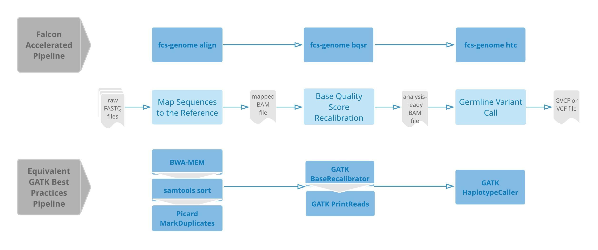

# Falcon Accelerated Genomics Pipeline User Guide
Release v2.0.0
08/31/2018

<!-- TOC depthFrom:2 depthTo:3 withLinks:1 updateOnSave:1 orderedList:0 -->

- [Introduction](#introduction)
- [Quick Start on Public Clouds](#quick-start-on-public-clouds)
- [FAQ](#faq)
- [System Requirements and Installation](#system-requirements-and-installation)
	- [Software Prerequisites](#software-prerequisites)
	- [System Setup](#system-setup)
	- [Preparation](#preparation)
- [Synopsis](#synopsis)
	- [Common Options](#common-options)
	- [Common GATK Options](#common-gatk-options)
	- [`fcs-genome align` Options](#fcs-genome-align-options)
	- [`fcs-genome bqsr` Options](#fcs-genome-bqsr-options)
	- [`fcs-genome baserecal` Options](#fcs-genome-baserecal-options)
	- [`fcs-genome printreads` Options](#fcs-genome-printreads-options)
	- [`fcs-genome htc` Options](#fcs-genome-htc-options)
	- [`fcs-genome joint` Options](#fcs-genome-joint-options)
	- [`fcs-genome mutect2` Options](#fcs-genome-mutect2-options)
	- [`fcs-genome depth` Options](#fcs-genome-depth-options)
	- [`fcs-genome gatk` Options](#fcs-genome-gatk-options)
	- [Additional Commands](#additional-commands)
- [Examples](#examples)
	- [Germline Variant Calling for WGS](#germline-variant-calling-for-wgs)
- [Configurations](#configurations)

<!-- /TOC -->

## Introduction
The Falcon Accelerated Genomics Pipelines (FAGP) comprising the `fcs-genome` software allows for variant calling for both germline and somatic mutations based on the GATK Best Practices pipelines. The performance of the pipelines is significantly improved with Falcon's acceleration technologies.

Symmetric to the GATK Best Practices pipelines, the typical workflow starts with raw FASTQ sequence paired-end reads and proceeds to obtain a filtered set of variants that can be annotated for further analysis. The figure below depicts the flow of the germline variant calling pipeline. Beginning with paired-end FASTQ sequence files, the first step is to map the sequences to the reference. The resulting mapped BAM file is sorted, and duplicates are marked. This step performed using the command fcs-genome align, is equivalent to BWA-MEM, samtools sort and picard MarkDuplicates of the GATK Best Practices pipelines.

The second step is to recalibrate base quality score to account for biases caused by the sequencing machine. The Falcon pipeline command for this is `fcs-genome bqsr`. Its GATK equivalent first runs the GATK BaseRecalibrator, which produces a table of recalibrated reads, followed by GATK PrintReads which implements the table of recalibrated reads to produce a new, analysis-ready BAM file. The final step is germline variant calling, implementing the command fcs-genome htc which corresponds to GATK HaplotypeCaller.


Figure 1. Side-by-side analysis of the Falcon Accelerated Pipeline and the GATK Best Practices Pipeline: The middle panel indicates the general workflow starting with 1. Mapping the FASTQ sequences to the reference 2. Recalibrating base quality score and finally 3. Calling germline variants. The upper and lower panels illustrate the command-line implementation of the workflow using the Falcon Accelerated Pipeline and GATK Best Practices Pipeline respectively.

A similar pipeline for somatic mutation call is also available through the use of another of GATK's Best Practices pipeline tool -- Mutect2. The initial steps of the pipeline remain the same, beginning with fcs-genome align and followed by fcs-genome bqsr. The primary difference is that in the case of Mutect2, two paired-end fastq sequence files are used as input -- that of the tumor sample and the normal sample. fcs-genome mutect2, which is the Falcon accelerated equivalent of GATK's Mutect2, takes as input BAM files of the tumor and normal samples. The resulting output is a VCF file comprising of somatic variant calls.

The table below shows which of the components of the GATK best practices have a Falcon accelerated counterpart and which ones are left in their original forms:

| Original Tool | Original Version | Command | Falcon Accelerated Command |
| --- | --- | --- | --- |  
| BWA | 0.7.13 | mem | align |
| samtools | 1.3 | view, sort | |
| picard | 1.141 | MarkDuplicates | |
| GATK | 3.8 | BaseRecalibrator | baserecal |
| | | PrintReads | printreads |
| | | HaplotypeCaller | htc |
| | | Mutect2 | mutect2 |
| | | DepthOfCoverage | depth |
| | | IndelRealigner | indel |
| | | UnifiedGenotyper | ug |
| | | CombinedGVCFs | joint |
| | | GenotypeGVCFs | |
| GATK | 4.0.6 | BaseRecalibrator | baserecal |
| | | ApplyBQSR | printreads |
| | | HaplotypeCaller | htc |
| | | Mutect2 | mutect2 |

This User Guide provides details on the setup of the Falcon Genome pipeline, command-line usage and a step-by-step example to run the variant calling pipeline.

## Quick Start on Public Clouds
- [AWS](aws/README.md)
- [Huawei Cloud](hwcloud/README.md)
- [Alibaba Cloud](aliyun/README.md)

## FAQ
[FAQ for Falcon Accelerated Genomics Pipelines.](FAQ.md)

## System Requirements and Installation
### Software Prerequisites
The software package of the Falcon Accelerated Genomics Pipelines is self-contained with required software. Please refer to the release notes inside each software distribution for each component and its version. The recommended operating system and required packages are listed as follows:
+ CentOS Linux 7.x
+ epel-release, boost, glog, gflags, protobuf, java

### System Setup
+ The software for fcs-genome is installed in /usr/local/falcon
+ System information can be modified and is stored in /usr/local/fcs-genome.conf. Details on tuning configuration parameters is explained in a later section.
+ Export fcs-genome and other required tools to the PATH: source /usr/bin/falcon/setup.sh

### Preparation
+ Working folder: Paths to the reference genome and the input data are required parameters for the pipeline to run.  Setting up a working folder containing this data and allowing it to be readable is a mandatory step before the start of the pipeline.
+ Temporary folder: Most steps in the pipeline produce intermediate files that need to be stored at a temporary location. It must be ensured that this location has free disk space between 3-5X times the size of the input files. The location of the temporary folder can be modified in /usr/local/fcs-genome.conf.
+ Falcon License: A valid license needs to be setup in the environment variable $LM_LICENSE_PATH. If the license file is improperly configured, an error message is reported:
[fcs-genome] ERROR: Cannot connect to the license server: -15
[fcs-genome] ERROR: Please contact support@falcon-computing.com for details.
+ Obtaining the Reference and its index: The reference and its index can be downloaded from the Broad Institute website using the following FTP link:
ftp://gsapubftp-anonymous@ftp.broadinstitute.org/bundle/  
To take full advantage of the FPGA acceleration provided by the Falcon Genome image, the reference genome needs to be preprocessed by running the script /usr/local/falcon/prepare-ref.sh <path-to-fasta>. This step is optional, and the regular reference genome files (FASTA) will still work without processing. The processed reference genome, on the other hand, will also work for other software such as BWA, Picard, GATK, etc.
+ Optional arguments: GATK relies on files with known variants in its processing. For example, known variant files including the 1000 Genome indel sites, the Mills indel sites and the dbSNP sites can be given as additional parameters for the pipeline steps. These can also be downloaded from the Broad Institute website.

## Synopsis
This section provides all the methods available in the fcs-genome command with their respective options settings.

```
fcs-genome align -r ref.fasta -1 input_1.fastq -2 input_2.fastq -o output.bam [--align-only]
fcs-genome align -r ref.fasta -F SampleSheet.csv -o output_dir [--align-only]

fcs-genome bqsr -r ref.fasta -i indel.bam -o recal.bam [--bqsr bqsr.grp] [--gatk4]
fcs-genome baserecal -r ref.fasta -i indel.bam -o bqsr.grp [--gatk4]
fcs-genome printreads -r ref.fasta -b bqsr.grp -i output.bam -o recal.bam [--gatk4]

fcs-genome htc -r ref.fasta -i recal.bam -o germline.gvcf [--gatk4]
fcs-genome mutect2 -r ref.fasta -n normal.bam -t tumor.bam -o somatic.vcf [--gatk4]
fcs-genome joint -r ref.fasta -i gvcf_dir -o final.vcf
```
For additional options, type in the command-line `fcs-genome [method]`.

### Common Options
The following options are available for all `fcs-genome` commands.

| Option | Alternative | Argument | Description |
| --- | --- | --- | --- |
| -h | --help | | print help messages |
| -f | --force | | overwrite output files if they exist |
| -O | --extra-options | String(\*) | access to GATK tools extra options. Use " " to enclose the option name and argument(s). Example "--option argrement" |

- The option `--force | -f` will force `fcs-genome` to overwrite output file if it already exists. By default, the tool will prompt user input if the specified output file(s) already exists.  
- The option `--extra-options | -O` is used to apply additional options to the downstream tools (bwa, GATK) that are not included in `fcs-genome`.
For example:  
   ```
   fcs-genome htc
        -r ref.fasta
        -i recal.bam \
        -o germline.vcf \
        --produce-vcf \
        --extra-options "-minPruning 4"
   ```
The command applies an option `-minPruning` (more details can be found [here](https://software.broadinstitute.org/gatk/documentation/tooldocs/3.8-0/org_broadinstitute_gatk_tools_walkers_haplotypecaller_HaplotypeCaller.php#--minPruning)) to the HaplotypeCaller step in GATK, and set the value to `4`.

### Common GATK Options

For GATK commands (e.g. `bqsr`, `htc`, `mutect2`), the following options are available.

| Option | Alternative | Argument | Description |
| --- | --- | --- | --- |
| -L | --intervalList | String | a interval file (e.g. BED) that specifies targeted region of interest for the analysis |
| -g | --gatk4 | | use GATK 4, if unset, GATK 3.8 will be used by default. |

- The option `--intervalList | -L` is used to specify targeted regions which analysis such as coverage and variant calling will be performed. This option should be used if sample was sequenced using a capture set since it optimizes computer resources and improves accuracy. For WGS samples, the interval list can be set to focus on a region of interest defined by the user. **NOTE**: Only a single interval list is supported. If the user needs multiple interval lists, the lists need to be merged manually.
- The option `--gatk4 | -g` is used to select between GATK 4 and GATK 3.8 to run a command. The corresponding `fcs-genome` command remains the same. For example, `fcs-genome printreads` calls GATK **PrintReads** by default. But with `--gatk4` flag, it calls GATK **ApplyBQSR** which is the new command in 4.0.
    Alternatively, a configuration `use_gatk4 = true` can be set in the *fcs-genome.conf* configuration file to enable GATK 4 for all commands, regardless of the option `--gatk4` being set or not. For more information, please refer to the section [Configurations](#configurations).

### `fcs-genome align` Options
The `align` command performs alignment using [bwa mem](https://github.com/lh3/bwa), and duplication marking using [picard](https://broadinstitute.github.io/picard/).
Given a set of pair-end FASTQ data as input, it produces a BAM file with all reads aligned, and duplication marked.

| Option | Alternative | Argument | Description |
| --- | --- | --- | --- |
| -r | --ref | String | reference genome path |
| -1 | --fastq1 | String | input pair-end Read 1 FASTQ file |
| -2 | --fastq2 | String | input pair-end Read 2 FASTQ file |
| -F | --sample_sheet | String | a sample sheet or path to a folder to FASTQ files|
| -o | --output | String | output BAM file, with  |
| -R | --rg | String | read group ID ('ID' in BAM header) |
| -S | --sp | String | sample ID ('SM' in BAM header) |
| -P | --pl | String | platform ID ('PL' in BAM header) |
| -L | --lb | String | library ID ('LB' in BAM header) |
| -l | --align-only | | skip mark duplicates |

- The options `-R, -S, -P, -L` specifies the read group in the aligned sample's header. If left blank, the tool will automatically select the appropriate values for each fields.
- If the option `--align-only` is set, no mark duplicate will be performed, and the output will be a single sorted BAM file.
- In `fcs-genome align`, option `-O|--extra-options` only supports options in `bwa` (see [this link](http://bio-bwa.sourceforge.net/bwa.shtml#3) for more details), and the following options:
    - `-filter`: Filtering out records with INT bit seton the FLAG field, similar to the -F argument in samtools (default: 0)

#### Known Limitations
1. `fcs-genome align` can only produce sorted BAM file, or mark duplicate BAM. For mark duplicate BAMs, duplications cannot be removed. To remove duplications, 3rd party tools such as `samtools` can be used.
2. Apart from the listed options, no other options in the original `samtools` and `picard` are supported.

### `fcs-genome bqsr` Options
The `bqsr` command performs Base Quality Score Recalibration over an input BAM file. This step is equivalent to *BaseRecalibrator* followed by *PrintReads* in GATK 3.x, or *BaseRecalibrator* and *ApplyBQSR* in GATK 4.x.
By default, the command generated a BAM file with bases qualities recalibrated, given an input BAM file. Additionally, if the argument `--bqsr` is set, it also produces a recalibration report.
The `bqsr` command is equivalent to calling `baserecal` and `printreads` consecutively.

| Option | Alternative | Argument | Description |
| --- | --- | --- | --- |
| -r | --ref | String | reference genome path |
| -b | --bqsr | String | output BQSR report path (if left blank, no file will be produced) |
| -i | --input | String | input BAM file path |
| -o | --output | String | output path; by default the output will be a folder with multiple BAM file parts; if `-m` is set, then a single BAM file will be produced |
| -K | --knownSites | List | known variant databses for recalibration (VCF format). If more than one VCF files are considered, multiple `-K` options should be used, one for each file |
| -m | --merge-bam | | merge output BAM parts into a single BAM file

### `fcs-genome baserecal` Options
The `baserecal` command generates a Base Quality Score Recalibration report given a BAM input. It is equivalent to the command *BaseRecalibrator* in GATK 3.x and 4.x.

| Option | Alternative | Argument | Description |
| --- | --- | --- | --- |
| -r | --ref | String | reference genome path |
| -i | --input | String | input BAM file |
| -o | --output | String | output BQSR report |
| -K | --knownSites | List | known variant databses for recalibration (VCF format). If more than one VCF files are considered, multiple `-K` options should be used, one for each file |

### `fcs-genome printreads` Options
The `printreads` command recalibrates the base qualities for a given BAM file input, using a pre-computed recalibration matrix specified in the BQSR report. It is equivalent to the command *PrintReads* in GATK 3.x, and *ApplyBQSR* in GATK 4.x.

| Option | Alternative | Argument | Description |
| --- | --- | --- | --- |
| -r | --ref | String | reference genome path |
| -b | --bqsr | String | input BQSR file |
| -i | --input | String | input BAM file or directory |
| -o | --output | String | output path; by default the output will be a folder with multiple BAM file parts; if `-m` is set, then a single BAM file will be produced |
| -m | --merge-bam | | merge output BAM parts into a single BAM file

### `fcs-genome htc` Options
The `htc` command calls SNP and INDEL variants using the *HaplotypeCaller* command in GATK 3.x and 4.x. It takes a BAM file as input and generates a gVCF file by default.  If `--produce-vcf` is set, a VCF file is generated instead of gVCF.

| Option | Alternative | Argument | Description |
| --- | --- | --- | --- |
| -r | --ref | String | reference genome path |
| -i | --input | String | input BAM file or directory |
| -o | --output | String | output gVCF/VCF file (if --skip-concat is set the output will be a directory of gVCF files) |
| -v | --produce-vcf | | produce VCF files from HaplotypeCaller instead of gVCF |
| -s | --skip-concat | | (deprecated) produce a set of GVCF/VCF files instead of one |

### `fcs-genome joint` Options
The `joint` command performs a joint variant calling from a set of compressed gVCF files located in a folder spedified with `--input-dir`. Each gVCF file must have its own index posted in the input folder. This command is often used together with `htc` for cohort analysis.

| Option | Alternative | Argument | Description |
| --- | --- | --- | --- |
| -r | --ref | String | reference genome path |
| -i | --input-dir | String | input dir containing compressed gVCF files |
| -o | --output | String | output compressed gVCF files |
| -c | --combine-only | | combine GVCFs only and skip genotyping |
| -g | --skip-combine | | (deprecated) perform genotype gVCFs only and skip combine gVCF |

### `fcs-genome mutect2` Options
The `mutect2` command calls somatic variats using the *Mutect2* in GATK 3.x and 4.x. The output VCF file includes both somatic single nucleotide (SNVs) as well as insertion and deletion variants. In addition to taking tumor BAM files as input, the tool also requires the inclusion of a matched normal. Mutect2 uses the normals as prefilters for the allelic sites.

As there are major differences of *Mutect2* usage between GATK 3.x and GATK 4.x, here we separate the options for two different versions.  

#### GATK 3.x Options
The table below shows the options in effect by default, when `--gatk4` flag or `use_gatk4` configuration is absent:

| Option | Alternative | Argument | Description |
| --- | --- | --- | --- |
| -r | --ref | String | reference genome path |
| -n | --normal | String | input normal BAM file or directory |
| -t | --tumor | String | input tumor BAM file or directory |
| -o | --output | String | output VCF file |
| -d | --dbsnp | List| list of dbsnp files for mutect2 |
| -c | --cosmic | List | list of cosmic files for mutect2 |

Additional documentations for GATK 3.x usage can be found in this [link](https://software.broadinstitute.org/gatk/documentation/tooldocs/3.8-0/org_broadinstitute_gatk_tools_walkers_cancer_m2_MuTect2.php)

#### GATK 4.x Options
| Option | Alternative | Argument | Description |
| --- | --- | --- | --- |
| -r | --ref | String | reference genome path |
| -n | --normal | String | input normal BAM file or directory |
| -t | --tumor | String | input tumor BAM file or directory |
| -o | --output | String | output VCF file |
| -m | --germline | String | VCF file containing annotate variant alleles by specifying a population germline resource |
| -p | --panels_of_normals | String| Panels of normals VCF file |
| -a | --normal_name | String | Sample name for Normal Input BAM. Must match the SM tag in the BAM header |
| -b | --tumor_name | String | Sample name for Tumor Input BAM. Must match the SM tag in the BAM header |

In GATK 4.x, two more options (`--normal_name` and `--tumor_name`) are required in addition to the filenames of the normal and tumor BAM file(s). These two options are used to specify the sample names for the normal and tumor samples, which in essense is the `SM` filed in the BAM header. 

Additional documentations for GATK 4.x usage can be found in this [link](https://software.broadinstitute.org/gatk/documentation/tooldocs/current/org_broadinstitute_hellbender_tools_walkers_mutect_Mutect2.php).

Panels of Normals (PON) is a VCF file generated from a collection of VCF files of normal samples. By definition, Normal samples are obtained from healthy tissues and their DNA are assumed not to have any somatic variants. Using a PON VCF file in the analysis helps to capture artifacts that appear recurrently in the sequencer and threfore improve variant calling analysis.  Another VCF file set by `--germline` that contains a common population variants with allele-specific frequencies is also used in variant filtering. Mutect2 uses these two VCF files to filter sites and the germline resource and matched normal to filter alleles.

### `fcs-genome depth` Options
The `depth` command calculates the depth of coverage for a given BAM input files. It is equivalent to GATK 3.x *DepthOfCoverage* command. The output will be a set of reports depending on the options selected.

| Option | Alternative | Argument | Description |
| --- | --- | --- | --- |
| -r | --ref | String | reference genome path |
| -i | --input | String | input BAM file |
| -o | --output | String | output coverage file |
| -g | --geneList | String | list of genes over which the coverage is calculated |
| -b | --omitBaseOutput |    | omit output coverage depth at each base (default: false) |
| -v | --omitIntervals |     | omit output coverage per-interval statistics (default false) |
| -s | --omitSampleSummary | | omit output summary files for each sample (default false |

**NOTE**: DepthOfCoverage is not available in GATK4. 

### `fcs-genome gatk` Options
The `gatk` emulates the original GATK 3.x commands and as such, there is no Falcon provided acceleration. Please refer to the [GATK documentation](https://software.broadinstitute.org/gatk/documentation/tooldocs/3.8-0/) for additional details.

#### Known Limitations
This command only supports GATK 3.x in the current version, GATK 4.x support will come in future releases.

### Additional Commands

There are a few additional commands available in the Falcon Accelerated Genomics Pipelines, which are either deprecated or not recommended by the GATK communities anymore. A brief description for each commands are provided below.

1. `fcs-genome indel`: Performs indel realignment to a given BAM file. It is equivalent to consecutively calling GATK 3.x *RealignerTargetCreator* and *IndelRealigner*. This command is not recommended since GATK 3.5, and is no longer supported in GATK 4. Our experiments show that this command does not have significant accuracy impact when using `fcs-genome htc` to call germline variants.
1. `fcs-genome ug`: Performs germline variant calling with *UnifiedGenotyper*, which is replaced by *HaplotypeCaller* since GATK 3.x, and is no longer supported in GATK 4.x.
1. `fcs-genome markdup`: Performs mark duplicates for a given BAM file. The feature of command is fully covered by `fcs-genome align`, but for cases where both unmarked and marked BAM files need to be preserved, this command offers an viable solution.

## Examples
This section shows the examples of `fcs-genome` usage with *BASH*.

### Germline Variant Calling for WGS
The following example is available in `$FALCON_HOME`/example-germline-wgs.sh`, and can be run with the following command, in the case where the sample id is *NA12878*:
```
> ./example-germline-wgs.sh NA12878
```

The content of the example script is shown below:
```
#!/bin/bash

# get sample id
sample_id=$1

# need to setup these variables before start
local_dir=/local
fastq_dir=/local/fastq
ref_dir=/local/ref
ref_genome=$ref_dir/human_g1k_v37.fasta
db138_SNPs=$ref_dir/dbsnp_138.b37.vcf

start_ts=$(date +%s)
set -x
fcs-genome align \
    -r $ref_genome \
    -1 $fastq_dir/${sample_id}_1.fastq.gz \
    -2 $fastq_dir/${sample_id}_2.fastq.gz \
    -o $local_dir/${sample_id}.bam \
    -R $sample_id -S $sample_id -L $sample_id -P illumina -f

fcs-genome bqsr \
    -r $ref_genome \
    -i $local_dir/${sample_id}.bam \
    -o $local_dir/${sample_id}.recal.bam \
    -K $db138_SNPs -f

fcs-genome htc \
    -r $ref_genome \
    -i $local_dir/${sample_id}.recal.bam \
    -o ${sample_id}.vcf -v -f
set +x

end_ts=$(date +%s)
echo "Pipeline finishes in $((end_ts - start_ts)) seconds"
```

This script essentially performs the same computation shown in the Figure in [Introduction](#introduction), which follows the Best Practices of germline variant calling using *HaplotypeCaller*.  

## Configurations
In `fcs-genome`, many configurations can be tuned to define the settings for each command-line option during the run. The default configuration settings are stored in */usr/local/falcon/fcs-genome.conf*. If a file with the same name *fcs-genome.conf* is presented in the present directory, its values will be used to overwrite the default values. In addition, environmental variables can be used to overwrite both default configurations and the configurations in *fcs-genome.conf* in the present directory.
An example of the configuration settings for the germline variant calling pipeline is as below:
```
temp_dir = /local/temp
gatk.ncontigs = 32
gatk.nprocs = 16
gatk.nct = 1
gatk.memory = 8
```
The key `temp_dir` specifies the system folder to store temporary files. Some steps in `fcs-genome`, including `align`, will write large files to a temporary folder. Please ensure this configuration is set to a location with enough space. The recommended free space is 3~5x the input data size.
The GATK steps, such as *BaseRecalibrator*, *PrintReads* and *HaplotypeCaller*, are run in parallel. By default, 32 total processes will be used for each GATK step. To change the default number, the key `gatk.ncontigs` be set. The configuration key `gatk.nprocs` is used to specify the number of concurrent processes in each step. `gatk.memory` the memory consumed by each process. Ideally, `gatk.nprocs` be less than or equal to the total number of CPU cores, and the product of `gatk.nprocs` and `gatk.memory` would be less than or equal to the total memory. The number of concurrent process number and memory per process can be changed to individual steps with the following format: `[step-name].nprocs`, `[step-name].memory`
