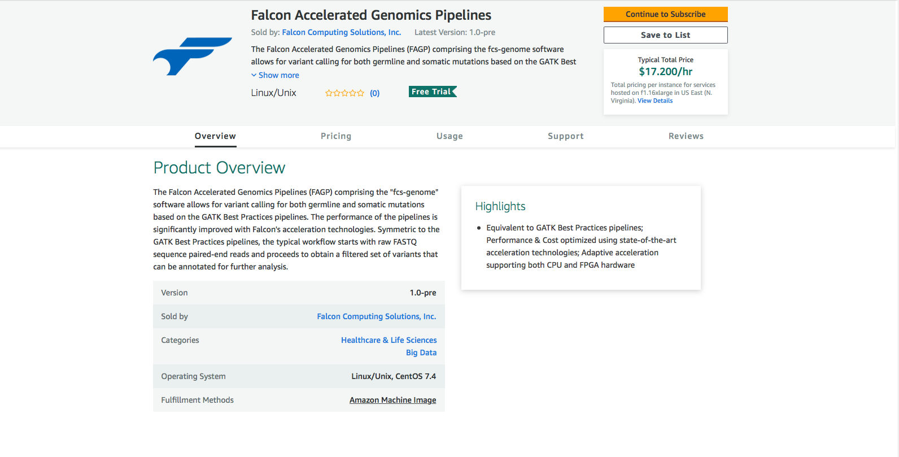
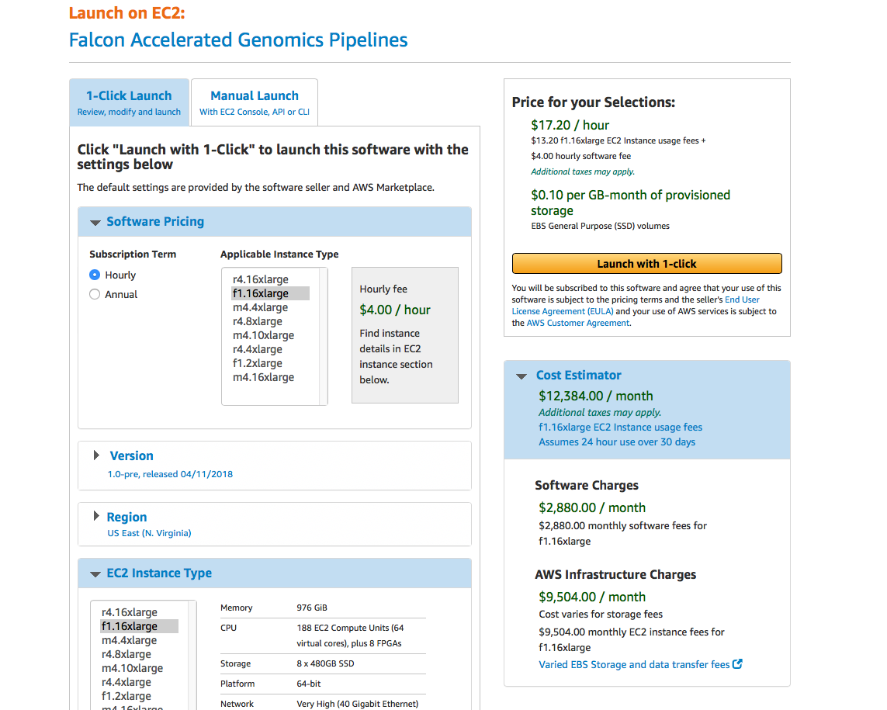
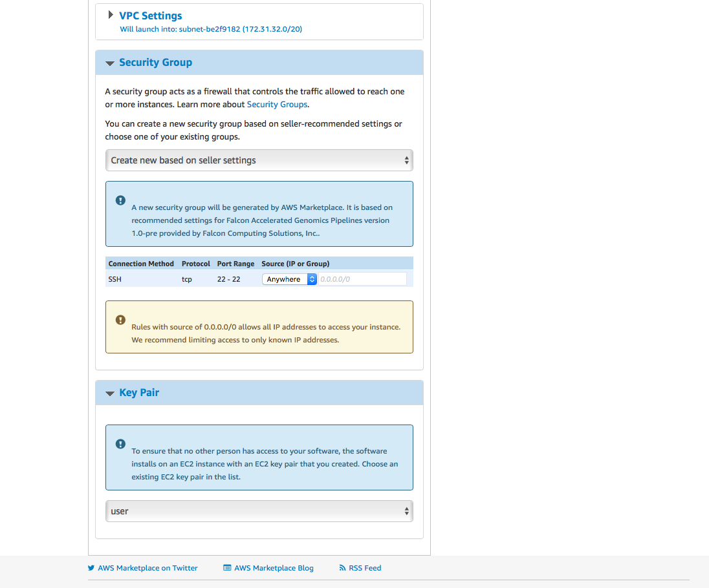
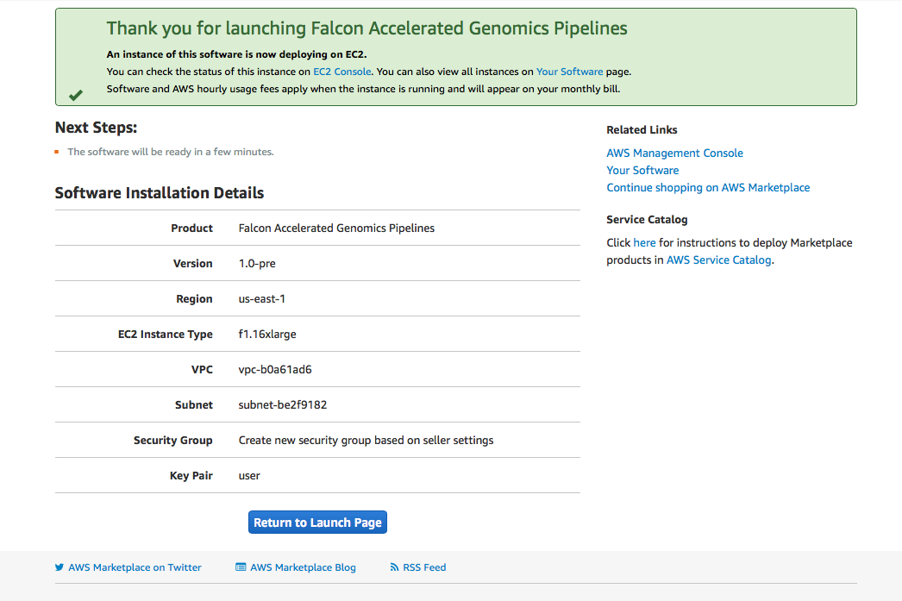
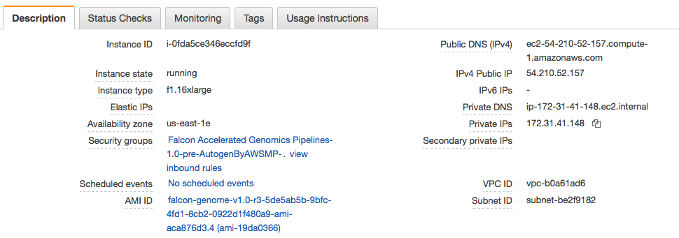

# Step-by-Step Guide for Using Falcon Genomics Image on AWS

## Create Instance
Go to the AWS Marketplace and find the Falcon Accelerated Genomics Pipelines



Click the yellow button "Continue to Subscribe". The top on the next page looks like as follow:



Choose your instance in the Software Pricing section. Scroll down and set the Key Pair as "user":



Once it is set, go to the top of the page and click the yellow button "Launch with 1-click". The next page should look like:



Go to the console and check the IP that is assigned to this instance:


 
## Login to Instance
Access to the instances can be done with SSH with a private key. The key needs to be created separately in AWS. In this example, we use the key 'user'. Below shows an example of the SSH command:
   ```
   [customer@localhost ~]$ ssh -i ~/.ssh/user.pem centos@172.31.41.148
   ```
## Checking Instance Settings
The fcs-genome executables should be located at /usr/local/falcon/. The version can be checked as follows:
   ```
   [centos@ip-172-31-41-148~]$ /usr/local/falcon/bin/fcs-genome
   Falcon Genome Analysis Toolkit v1.1.2-13
   Usage: fcs-genome [command] <options>

   Commands:
     align           align pair-end FASTQ files into a sorted,             
                     duplicates-marked BAM file                            
     markdup         mark duplicates in an aligned BAM file                
     bqsr            base recalibration with GATK BaseRecalibrator         
                     and GATK PrintReads                                   
     baserecal       equivalent to GATK BaseRecalibrator                   
     printreads      equivalent to GATK PrintReads                         
     htc             variant calling with GATK HaplotypeCaller             
     indel           indel realignment with GATK IndelRealigner            
     joint           joint variant calling with GATK GenotypeGVCFs         
     ug              variant calling with GATK UnifiedGenotyper            
     gatk            call GATK routines                                    
   ```

## Do It Yourself : All-In-One Single BASH Script
The BASH script /local/SetupInstance.sh was designed to test the image from the beginning to the end in one single command line. The script assumes two premises: 1) /local/ is the working directory with two folders fastq/ and ref/, and 2) Executables are located at FALCON_DIR=/usr/local/falcon/.  

The script workflow is the following:
1. Populate /local/ref/ folder with input files from bucket s3://fcs-genome-pub/ref/ in aws s3 repository. 
2. Copy example-wgs-germline.sh from /usr/local/falcon/ to /local/.
3. Populate /local/fastq/ folder with WES samples (NA12878) from bucket s3://fcs-genome-pub/samples/WES/ in aws s3 repository.
4. Extract few reads for testing purposes and save the outputs as NA12878_1.fastq and NA12878_2.fastq.
5. Submit test :  ./example-wgs-germline.sh  NA12878  (Testing align, bqsr and htc).
6. Download trio BAM files (NA12878, NA12891 and NA12892) from aws s3 public repository and test fcs-genome ug. 
7. Download gvcf files from aws s3 public repository (NA12878, NA12891 and NA12892) and test fcs-genome htc. 
8. Download normal/tumor pair from aws s3 public repository, and extract some reads for sampling. Test fcs-genome mutect2. 


Run the script from the working directory (/local/):
  ```
  [centos@ip-172-31-41-148 /local]$ nohup ./SetupInstance.sh &
  ```
The subsections below explain each step of the set_instance.sh BASH scripts workflow in full-detail. This will allow users to customize the script, adapt it or create new scripts according to their needs. 

### 1. Populate /local/ref/ folder with input files from bucket s3://fcs-genome-pub/ref/ in aws s3 repository. 
To perform alignment and variant calling, some files need to be available in the /local/ref/ folder:
  ```
  aws s3 cp s3://fcs-genome-pub/ref/ /local/ref/ --exclude  "*"  --include  "human_g1k_v37.*" --no-sign-request --recursive
  aws s3 cp s3://fcs-genome-pub/ref/ /local/ref/ --exclude  "*"  --include  "dbsnp_138.b37*" --no-sign-request --recursive
  ```

### 2. Copy example-wgs-germline.sh from /usr/local/falcon/ to /local/.

If all the steps above are successfully completed, all the input files and executables are in place. 
The BASH script example-wgs-germline.sh will perform three methods of fcs-genome: align, bqsr and htc:
```
#!/bin/bash
sample_id=$1

# need to setup these variables before start
local_dir=/local
fastq_dir=$local_dir/fastq
ref_dir=$local_dir/ref
ref_genome=$ref_dir/human_g1k_v37.fasta
db138_SNPs=$ref_dir/dbsnp_138.b37.vcf

start_ts=$(date +%s)
set -x 
fcs-genome align \
    -r $ref_genome \
    -1 $fastq_dir/${sample_id}_1.fastq.gz \
    -2 $fastq_dir/${sample_id}_2.fastq.gz \
    -o $local_dir/${sample_id}.bam \
    -R $sample_id -S $sample_id -L $sample_id -P illumina -f

fcs-genome bqsr \
    -r $ref_genome \
    -i $local_dir/${sample_id}.bam \
    -o $local_dir/${sample_id}.recal.bam \
    -K $db138_SNPs -f

fcs-genome htc \
    -r $ref_genome \
    -i $local_dir/${sample_id}.recal.bam \
    -o ${sample_id}.vcf -v -f
set +x

end_ts=$(date +%s)
echo "Pipeline finishes in $((end_ts - start_ts)) seconds"

```

### 3. Populate /local/fastq/ folder with WES samples (NA12878) from bucket s3://fcs-genome-pub/samples/WES/ in aws s3 repository.
A paired-end of FASTQ files are posted in /local/fastq/: NA12878-Rep01_S1_L001_R1_001.fastq.gz and NA12878-Rep01_S1_L001_R2_001.fastq.gz. This set of FASTQ files comes from the Public Data repository in [Illumina BaseSpace](https://basespace.illumina.com) (account required). Please refer to the README file posted in the bucket s3://fcs-genome-pub/samples/WES/ for additional details. 
   ```
   aws s3 --no-sign-request cp s3://fcs-genome-pub/samples/WES/ /local/fastq/  --recursive  --exclude "*" --include "NA*gz"
   ```
Here, the user can use any set of FASTQ files to perform the test if it chooses to do so.

### 4. Extract few reads for testing purposes and save the outputs as NA12878_1.fastq and NA12878_2.fastq.
Since the purpose is to test the image, a small sampling of the FASTQ files is good enough to start. 
```
zcat /local/fastq/NA12878-Rep01_S1_L001_R1_001.fastq.gz | head -n 40000 > /local/fastq/NA12878_1.fastq; gzip /local/fastq/NA12878_1.fastq
zcat /local/fastq/NA12878-Rep01_S1_L001_R2_001.fastq.gz | head -n 40000 > /local/fastq/NA12878_2.fastq; gzip /local/fastq/NA12878_2.fastq 
```
The user can skip this part and go the full test. In this case, it needs to make sure the input FASTQ files has the format ${SAMPLE}_1.fastq.gz and ${SAMPLE}_2.fastq.gz

### 5. Submit test :  ./example-wgs-germline.sh  NA12878 (Testing align, bqsr and htc).
This scripts processes a pair of FASTQ files and perform three features of fcs-genome : alignmnet, base quality recalibration and haplotype calling:
```
nohup ./example-wgs-germline.sh  NA12878  &
```

### 6. Download trio BAM files (NA12878, NA12891 and NA12892) from aws s3 public repository and test fcs-genome ug. 
fcs-genome has the UnifiedGenotyper (ug) feature available in this release. To test it, there is a trio set available from the aws s3 public repository:
```
mkdir /local/ug/
aws s3 --no-sign-request cp s3://fcs-genome-pub/samples/WES/Trio/bam/ /local/ug/ --recursive --exclude "*" --include "*bam*"
fcs-genome ug --ref /local/ref/human_g1k_v37.fasta -i /local/ug/NA12878_merged_recal.bam  --extra-options "-I /local/ug/NA12891_merged_recal.bam -I /local/ug/NA12892_merged_recal.bam" -o /local/ug/NA12878_ug.vcf
```

### 7. Download gvcf files from aws s3 public repository (NA12878, NA12891 and NA12892) and test fcs-genome joint. 
Create folders called /local/joint (for the original gvcf) and /local/joint_test/ (for sampling) and populate /local/joint:
```
mkdir /local/joint  /local/joint_test
aws s3  cp s3://fcs-genome-pub/samples/WES/Trio/vcf/  joint/  --recursive --exclude "*" --include "*gvcf*"
```

Using a BASH script, extract some variants and populate /local/joint_test/ to test the joint feature:

```
BGZIP="/usr/local/falcon/tools/bin/bgzip"
TABIX="/usr/local/falcon/tools/bin/tabix"
array=(NA12878 NA12891 NA12892)
for acc in ${array[@]}
   do 
     zcat joint/${acc}.gvcf.gz | head -n 100000 | ${BGZIP} -c > joint_test/${acc}_small.gvcf.gz; ${TABIX} -p vcf joint_test/${acc}_small.gvcf.gz
   done
```
Submit job:

```
fcs-genome joint -r $ref_genome  -i /local/joint_test/  -o /local/joint_test/trio.gvcf
```

### 8. Download normal/tumor pair from aws s3 public repository, and extract some reads for sampling. Test fcs-genome mutect2. 
The dataset can be obtained in the GATK tutorial for mutect2.
```
aws s3  cp s3://fcs-genome-pub/samples/mutect2/Broad/ /local/fastq/  --recursive  --exclude "*" --include "*fastq*gz"
```
For mutect2, the cosmic VCF file is used:
```
aws s3  cp s3://fcs-genome-pub/ref/  /local/ref/ --recursive  --exclude "*" --include "b37_cosmic_v54_120711*"
```
Using a BASH script, extract some reads from normal/tumor FASTQ files for sampling:
```
NORMAL_R1=normal_1.fastq.gz
NORMAL_R2=normal_2.fastq.gz
TUMOR_R1=tumor_1.fastq.gz
TUMOR_R2=tumor_2.fastq.gz
zcat /local/fastq/${NORMAL_R1} | head -n 400000 > /local/fastq/normal_small_1.fastq; gzip /local/fastq/normal_small_1.fastq
zcat /local/fastq/${NORMAL_R2} | head -n 400000 > /local/fastq/normal_small_2.fastq; gzip /local/fastq/normal_small_2.fastq
zcat /local/fastq/${TUMOR_R1} | head -n 400000 > /local/fastq/tumor_small_1.fastq; gzip /local/fastq/tumor_small_1.fastq
zcat /local/fastq/${TUMOR_R2} | head -n 400000 > /local/fastq/tumor_small_2.fastq; gzip /local/fastq/tumor_small_2.fastq
```
Submit jobs:
```
nohup ./example-wgs-germline.sh  normal_small
nohup ./example-wgs-germline.sh  tumor_small
```
Perform mutect2:
```
REF=/local/ref/human_g1k_v37.fasta
NORMAL_BAM=/local/normal_small.recal.bam
TUMOR_BAM=/local/tumor_small.recal.bam
VCF=/local/somatic_calls.g.vcf
SNP=/local/ref/dbsnp_138.b37.vcf
COSMIC=/local/ref/b37_cosmic_v54_120711.vcf
fcs-genome mutect2 -r ${REF} -n ${NORMAL_BAM} -t ${TUMOR_BAM} -o ${VCF} --dbsnp ${SNP} --cosmic ${COSMIC}
```

For more details about other features available in fcs-genome, please refers to the full User Guide
